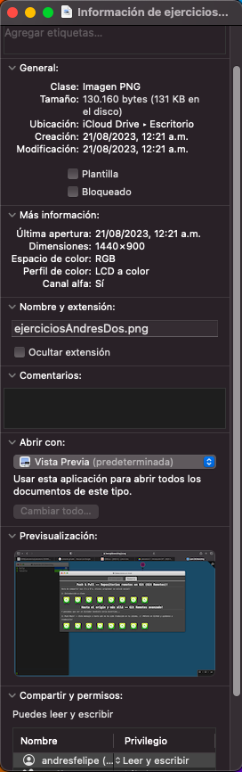

#  **Andrés Felipe arias Ajiaco**

> 1. *Edad:* 22 Años
> 2. *Programa:* Ingenería de sistemas
> 3. *Semestre:* Octavo
> 4. *Correo:* [dinho2001.7@gmail.com](mailto:dinho2001.7@gmail.com)
## Hobbies

> * Me gusta viajar
> * Me gusta jugar al fútbol
> * Mi video Juego favorito es **Call Of Dutty Mobile**
> * Me gusta ver peliculas
> * Mi jugador favorito se llama **Ronaldo de Assis Moreira** conocido como *RONALDINHO*


## Mi primer codigo
```
num = int(input("Digite un numero:"))
divisor = 1
divisores = []
t_divisores = 0
num % divisor

while divisor <= num:
    if num % divisor == 0:
        divisores.append(divisor)
        divisor = divisor + 1
        t_divisores = t_divisores + 1
    elif num % divisor != 0:
        divisor = divisor + 1
        num % divisor

divisores.reverse()
print(divisores[0:])
print(f"{t_divisores} divisores")

```
## Prueba ejercicio Git Branching



