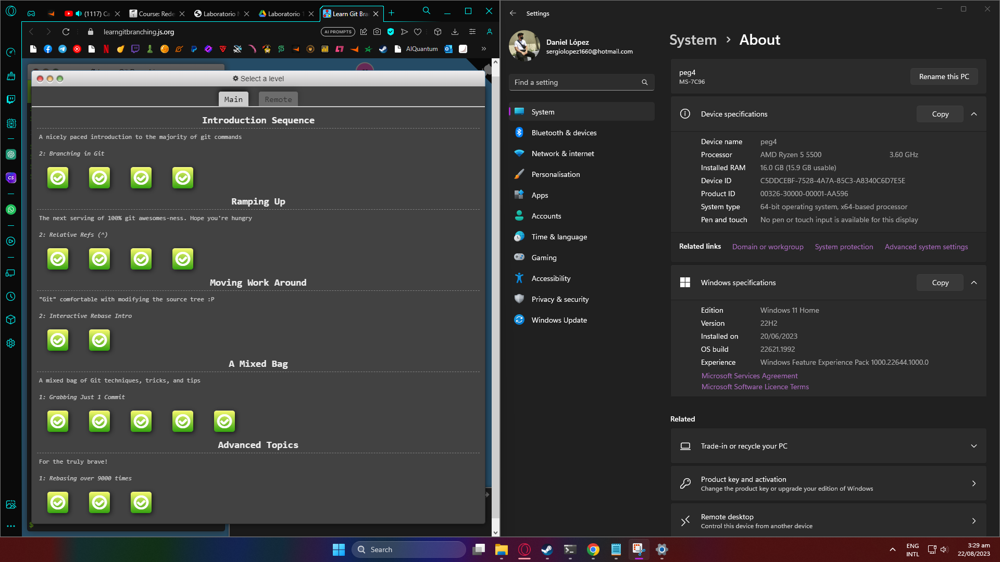

#  *Sergio daniel lopez vargas*

> * **Edad:** 20 Años
> * **Programa:** Ingeneria de sistemas
> * **Semestre:** Octavo
> * **Correo:** [slopez@gmail.com](mailto:slopez@gmail.com)
## Hobby
Csgo es mi juego favorito, tengo un total de 6100 **horas** y lo he juego desde 2016


## Mi primer codigo
```
print("me voy a la cocina")
print("abro la nevera")

hay_leche = input("hay leche? (S/N)")
if hay_leche == "S":
    print("sacamos la leche de la nevera")
print("hemos terminado")
```
## Ejercicios GitBranch


